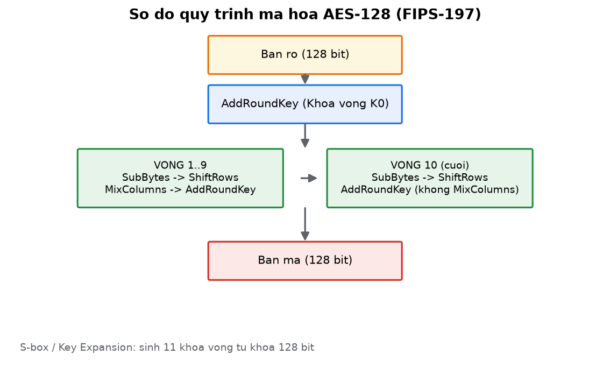
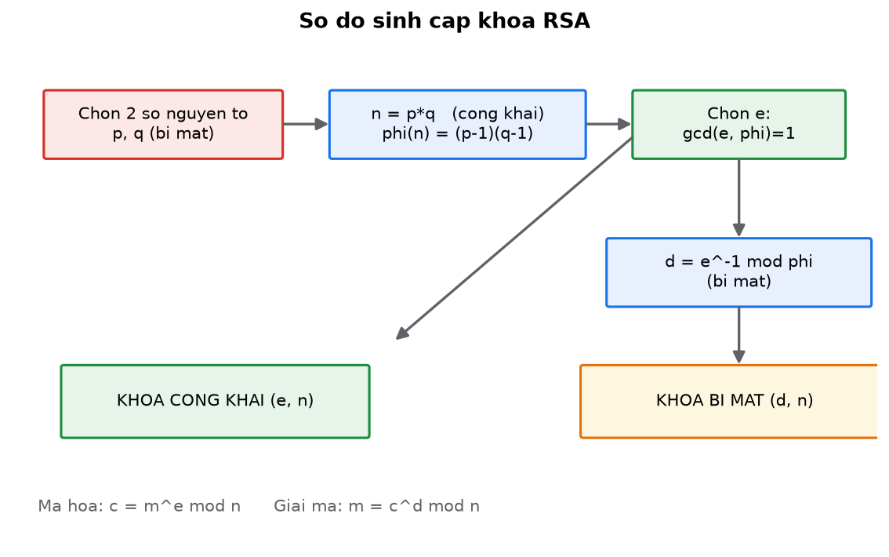
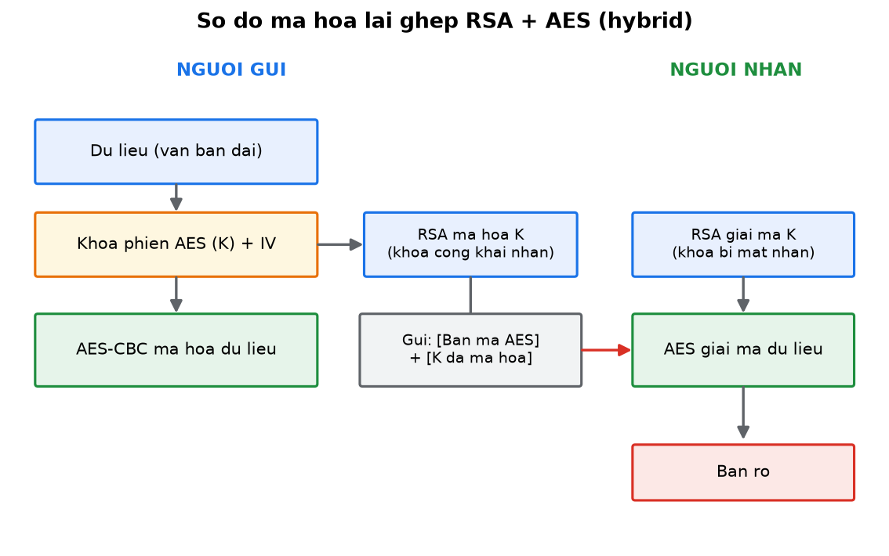
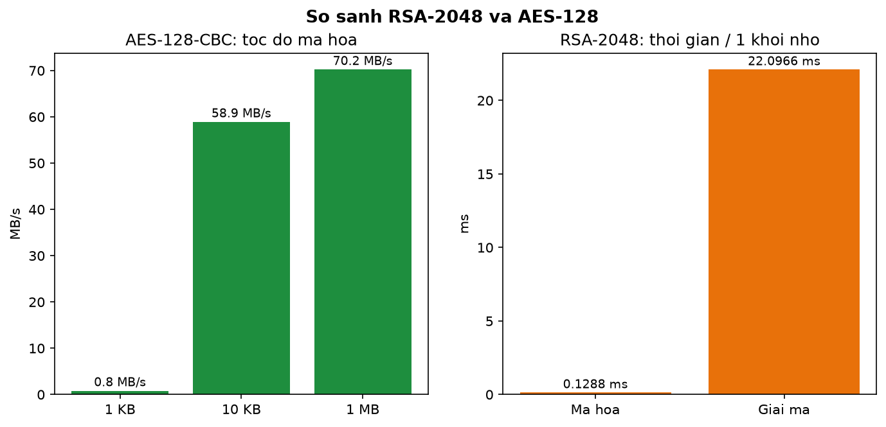

# BÁO CÁO BÀI TẬP VỀ NHÀ — AN TOÀN VÀ BẢO MẬT THÔNG TIN

| Thông tin | Nội dung |
|---|---|
| **Môn học** | An toàn và Bảo mật Thông tin |
| **Lớp** | 59KMT |
| **Giảng viên hướng dẫn** | Đỗ Duy Cốp |
| **Sinh viên thực hiện** | Trần Văn Khải |
| **MSSV** | K235480106035 |
| **Deadline** | 23h59 ngày 28/9/2026 |
| **Hình thức** | Push lên GitHub (public) |

---

## 1. Mục tiêu
Tìm hiểu và **cài đặt** các thuật toán mã hóa hiện đại (**DES, AES**) và mã hóa bất đối xứng
(**RSA**); trình bày các **mô hình áp dụng RSA**, **so sánh RSA – AES** và cách **kết hợp hai
thuật toán** (hybrid encryption).

## 2. Yêu cầu đề bài

**Bài 1 — DES, AES**
1. Tìm hiểu thuật toán mã hóa DES, AES: mô tả thuật toán, quy trình mã hóa/giải mã.
2. Cài đặt AES bằng một ngôn ngữ lập trình.

**Bài 2 — RSA**
1. Tìm hiểu thuật toán mã hóa bất đối xứng RSA.
2. Trình bày nguyên lý sinh cặp khóa bí mật / công khai.

**Bài 3 — Mô hình áp dụng RSA**
1. Trình bày các mô hình: xác thực người gửi, xác thực người nhận, cả hai.
2. So sánh thời gian mã hóa/giải mã của RSA với AES.
3. Đề xuất cách kết hợp sức mạnh của RSA và AES.

## 3. Công nghệ / Kiến thức sử dụng

| Thành phần | Nội dung |
|---|---|
| Ngôn ngữ | Python 3 |
| Mã hóa đối xứng | DES (mô tả), **AES-128** (tự cài đặt, ECB + CBC) |
| Mã hóa bất đối xứng | **RSA** (Miller–Rabin, Euclid mở rộng, ký/xác thực) |
| Benchmark | `pycryptodome` (AES bản C) so với RSA-2048 |
| Chuẩn tham chiếu | FIPS-197 (AES) |

## 4. Cấu trúc thư mục

```text
BAITAP_ATTT/
├── README.md
├── run-all.sh                          # chạy toàn bộ 3 bài
├── bt01_des-aes/
│   ├── README.md                       # mô tả DES/AES + cài đặt AES
│   └── aes.py                          # cài đặt AES-128 thuần Python
├── bt02_rsa-keygen/
│   ├── README.md                       # nguyên lý sinh khóa RSA
│   └── rsa_keygen.py
├── bt03_rsa-models-hybrid/
│   ├── README.md
│   ├── rsa_util.py                     # tiện ích RSA
│   ├── aes.py
│   ├── rsa_models.py                   # 3 mô hình áp dụng RSA
│   ├── hybrid_rsa_aes.py               # mã hóa lai ghép RSA + AES
│   └── bench_rsa_vs_aes.py             # so sánh tốc độ RSA vs AES
├── evidence/BAI1-2-3-KETQUA.md         # log chạy thực tế
└── images/                             # ảnh minh chứng + sơ đồ
```

## 5. Cách chạy

```bash
python3 --version             # cần Python 3
pip3 install pycryptodome     # cho phần benchmark (AES bản C)
bash run-all.sh               # chạy toàn bộ
```

## 6. Kết quả

| Nội dung | Kết quả |
|---|---|
| AES-128 vector FIPS-197 | `69c4e0d86a7b0430d8cdb78070b4c55a` → **PASS** |
| AES-CBC mã/giải mã | round-trip **OK** |
| RSA-2048 sinh khóa + mã/giải mã | **OK** |
| 3 mô hình RSA | **HỢP LỆ**; sửa nội dung bị **từ chối** |
| Hybrid RSA + AES | khóa AES khôi phục **khớp**, giải mã **OK** |
| Tốc độ | AES ~**70 MB/s**; RSA-2048 ~**129 µs** mã / ~**22 ms** giải 1 khối |

### Sơ đồ minh họa









> Danh sách ảnh chụp màn hình cần chụp: xem [`images/README.md`](images/README.md).
> Log chạy đầy đủ: [`evidence/BAI1-2-3-KETQUA.md`](evidence/BAI1-2-3-KETQUA.md).

## 7. Tiến độ

- [x] Mô tả DES & AES (thuật toán, quy trình mã/giải mã)
- [x] Cài đặt AES-128 (Python thuần, ECB + CBC), kiểm thử FIPS-197
- [x] RSA: nguyên lý sinh cặp khóa + cài đặt
- [x] 3 mô hình áp dụng RSA (người gửi / người nhận / cả hai)
- [x] So sánh thời gian mã hóa/giải mã RSA với AES
- [x] Mã hóa lai ghép RSA + AES (hybrid)
- [x] README + log kết quả
- [ ] Ảnh chụp màn hình kết quả (chờ bổ sung)

## 8. Nhận xét & kết luận
- **AES** nhanh, phù hợp dữ liệu lớn; **RSA** chậm nhưng giải quyết bài toán trao khóa/chữ ký.
- **Kết hợp**: mã hóa dữ liệu bằng **AES**, mã hóa khóa AES bằng **RSA** (như TLS/HTTPS, PGP).

---
*Báo cáo được trình bày bởi Trần Văn Khải — MSSV: K235480106035.*
